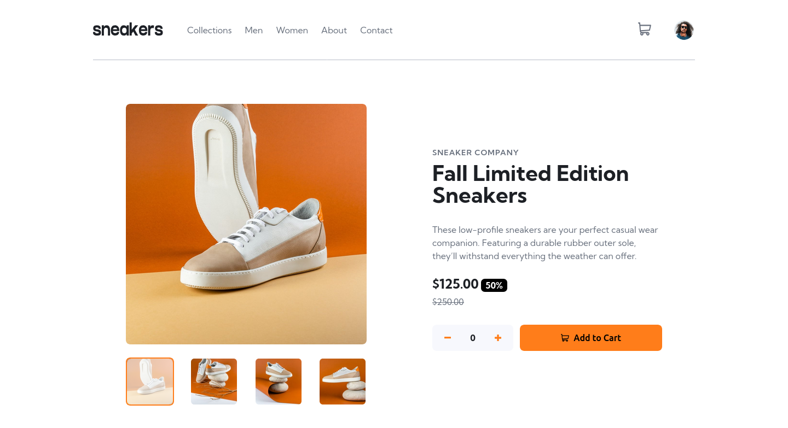

# Frontend Mentor - E-commerce product page solution

This is a solution to the [E-commerce product page challenge on Frontend Mentor](https://www.frontendmentor.io/challenges/ecommerce-product-page-UPsZ9MJp6). Frontend Mentor challenges help you improve your coding skills by building realistic projects.

## Table of contents

- [Overview](#overview)
  - [The challenge](#the-challenge)
  - [Screenshot](#screenshot)
  - [Links](#links)
- [My process](#my-process)
  - [Built with](#built-with)
  - [What I learned](#what-i-learned)
- [Author](#author)
- [Acknowledgments](#acknowledgments)


## Overview

### The challenge

Users should be able to:

- View the optimal layout for the site depending on their device's screen size
- See hover states for all interactive elements on the page
- Open a lightbox gallery by clicking on the large product image
- Switch the large product image by clicking on the small thumbnail images
- Add items to the cart
- View the cart and remove items from it

### Screenshot




### Links

- Solution URL: [Add solution URL here](https://fa23bcs233.github.io/interactive-product-page/)
- Live Site URL: [Add live site URL here](https://github.com/fa23bcs233/interactive-product-page/)

## My process

### Built with

- Semantic HTML5 markup
- CSS custom properties
- Flexbox
- CSS Grid

### What I learned

In the challenge I reached the stage where the code was becomming messy and unmangeable therefore I shifted my approach to make the code base into the classes and used OOP concepts. Also to keep the repeating thing more mangeable I implemented the lightbox with the help of DOM instead of repeating the crousal implementations.Learned to use the templates in HTML

There are some blinks of the above stated:


```html
  <section class="lightbox">
    <div class="close">
      <svg width="14" height="15" xmlns="http://www.w3.org/2000/svg">
        <path
          d="m11.596.782 2.122 2.122L9.12 7.499l4.597 4.597-2.122 2.122L7 9.62l-4.595 4.597-2.122-2.122L4.878 7.5.282 2.904 2.404.782l4.595 4.596L11.596.782Z"
          fill="#69707D" fill-rule="evenodd"  onclick="hideLightBox()" />
      </svg>
    </div>
    <div class="lightbox-crousal">

    </div>
  </section>

  <template id="cart-item-template">
    <li class="cart-item">
      
      <div class="cart-item-details">
        <div>
          <span class="cart-item-name"></span>
        </div>
        <div>
          <span class="cart-item-price"></span> x
          <span class="cart-item-quantity"></span>
          <span class="cart-item-total"></span>
        </div>
      </div>
      <button class="remove-item">
        
      </button>
    </li>
  </template>

```

```js
class Slider{
    constructor(slider,sliderContainer, sliderTrack, prevButton, nextButton, controls){
        this.slider = document.querySelector(slider);
        this.sliderContainer = this.slider.querySelector(sliderContainer);
        this.prevButton = this.slider.querySelector(prevButton) || undefined;
        this.nextButton = this.slider.querySelector(nextButton) || undefined;
        this.controls = this.slider.querySelectorAll(controls) || undefined;
        this.sliderTrack = this.sliderContainer.querySelector(sliderTrack);
        this.currentSlideIndex = 0;

        this.init();
    }


    init(){
        this.setSlideIndex(this.currentSlideIndex);
        if(this.controls){
            this.setControls();
        }

        this.initNavigation();
    }

    transformSlides(){
        const translateX = this.currentSlideIndex * -100;
        this.sliderTrack.style.transform = `translateX(${translateX}%)`;
        this.sliderTrack.style.transition = 'transform 0.3s ease';
    }

    setSlideIndex(index){
        this.currentSlideIndex = index;
        this.transformSlides();
        this.activateControl();
    }

    activateControl(){
        this.controls.forEach(ctrl=>{
            ctrl.classList.remove("active");
        })
        this.controls[this.currentSlideIndex].classList.add("active");
    }

    setControls(){
        this.controls.forEach(control => {
            control.addEventListener("click", (e) => {
                const slideIndex = parseInt(e.currentTarget.getAttribute("data-refSlide"));
                this.setSlideIndex(slideIndex);
            }); 
        });

    }
    
    initNavigation(){
        this.prevButton?.addEventListener("click", () => {
            if(this.currentSlideIndex > 0)
                this.setSlideIndex(this.currentSlideIndex - 1);
        });
        this.nextButton?.addEventListener("click", () => {
            if(this.currentSlideIndex < (this.controls.length - 1))
                this.setSlideIndex(this.currentSlideIndex + 1);
        });
    }
}


// Implementing the lightbox
const lightBoxContainer = document.querySelector(".lightbox");
const lightBox = lightBoxContainer.querySelector(".lightbox-crousal");
const mainCrousal = document.querySelector(".product-image-container")
lightBox.innerHTML = mainCrousal.innerHTML;
new Slider(".lightbox-crousal", ".main-image-crousal", ".main-img-crousal-track", ".prev-slide", ".next-slide", ".thumbnails-images-container .thumbnail-image");

function showLightBox(){
    lightBoxContainer.style.display = "flex";
}

function hideLightBox(){
    lightBoxContainer.style.display = "none";   
}


// render Cart
renderCart(){
        this.cartList.innerHTML = "";
        if(this.cartItems.length === 0){
            document.getElementById('empty-cart').removeAttribute('hidden');
            document.querySelector('.checkout-button').setAttribute("hidden", "");
            this.cartBadge.textContent = "0";
            this.cartBadge.setAttribute('hidden', '');
            this.cartBadge.classList.add('zero');
        }
        else {
            document.getElementById('empty-cart').setAttribute('hidden', '');
            document.querySelector('.checkout-button').removeAttribute("hidden");
            this.cartBadge.textContent = this.totalItems;
            this.cartBadge.removeAttribute('hidden');
            this.cartBadge.classList.remove('zero');
        }

        this.cartItems.forEach(cartItem => {
            const itemElement = this.cartItemTemplate.content.cloneNode(true);
            console.log(itemElement);
            itemElement.querySelector('.cart-item-image').src = cartItem.featureImage;
            itemElement.querySelector('.cart-item-name').textContent = cartItem.name;
            itemElement.querySelector('.cart-item-quantity').textContent = cartItem.quantity;
            itemElement.querySelector('.cart-item-price').textContent = `$${(cartItem.price * cartItem.quantity).toFixed(2)}`;
            itemElement.querySelector('.cart-item-total').textContent = `$${(cartItem.price * cartItem.quantity).toFixed(2)}`;  
            itemElement.querySelector('.remove-item').addEventListener('click', () => {
                this.removeItemFromCart(cartItem);
            });
            
            this.cartList.appendChild(itemElement);
        })
    }
```


## Author

- Website - [Muhammad Arham](#)
- Frontend Mentor - [@fa23bcs233](https://www.frontendmentor.io/profile/fa23bcs233)

